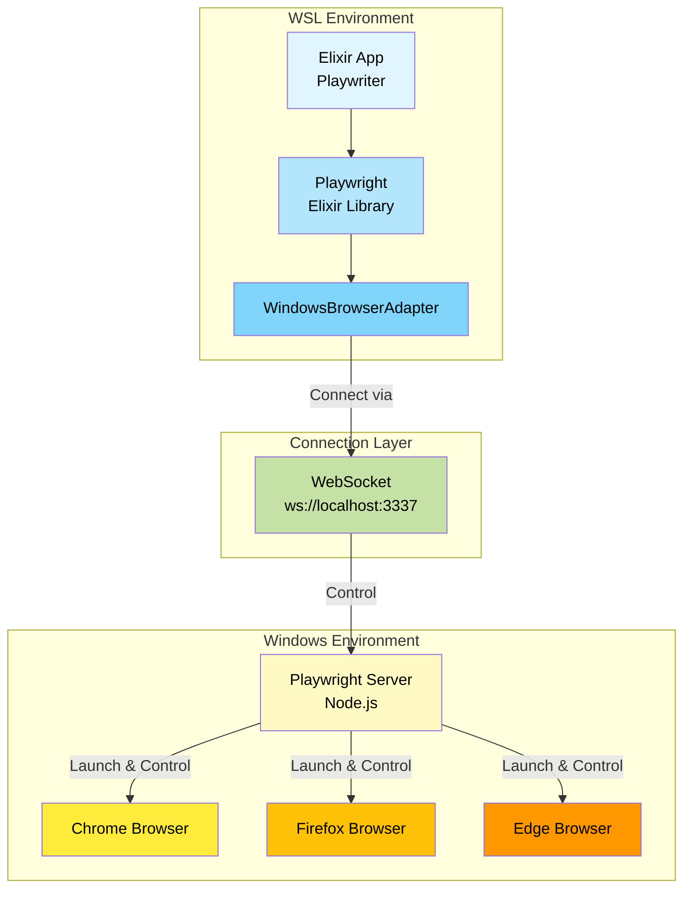
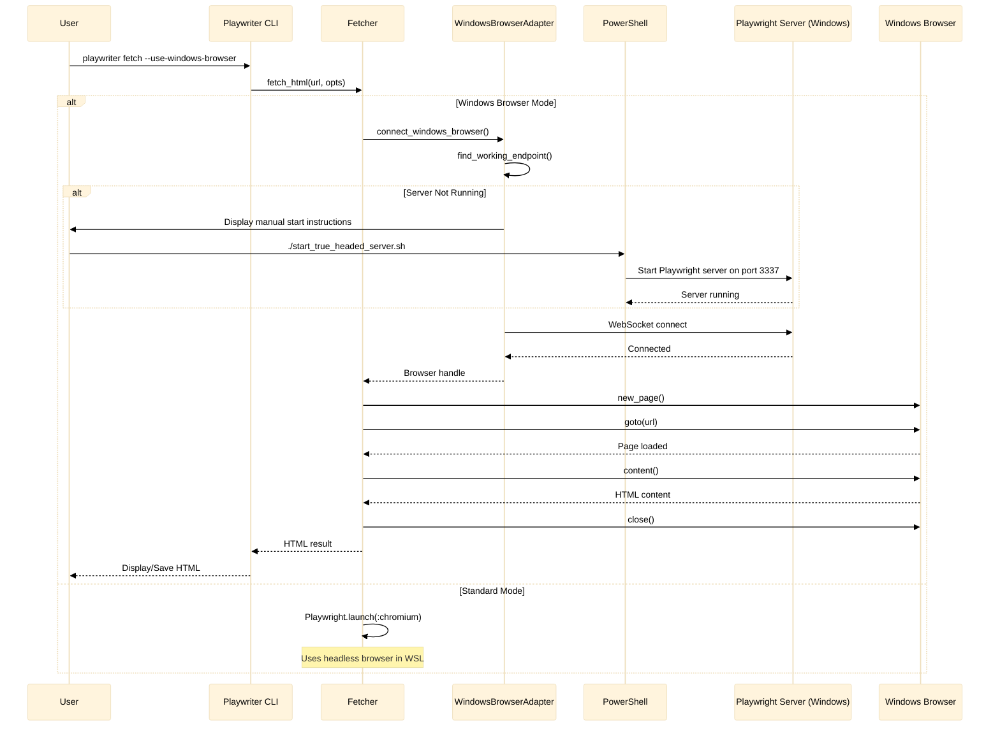
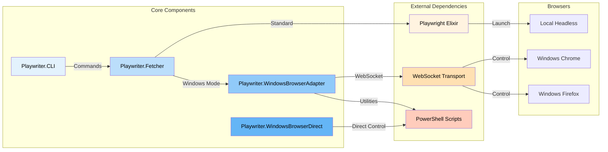
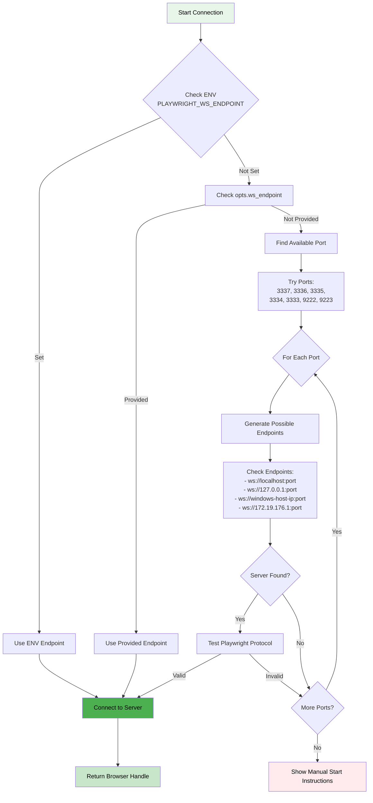
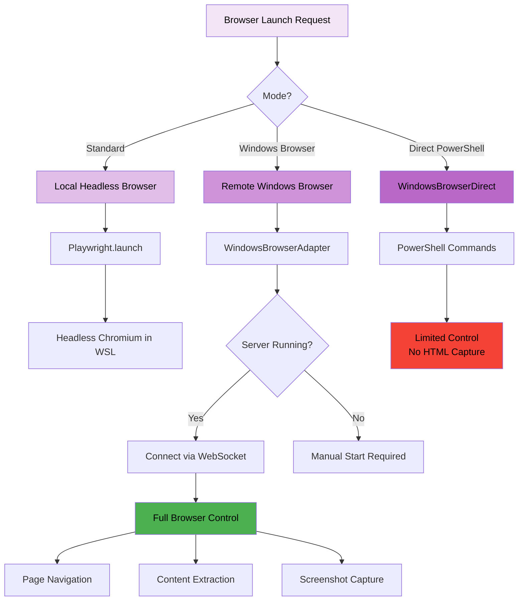
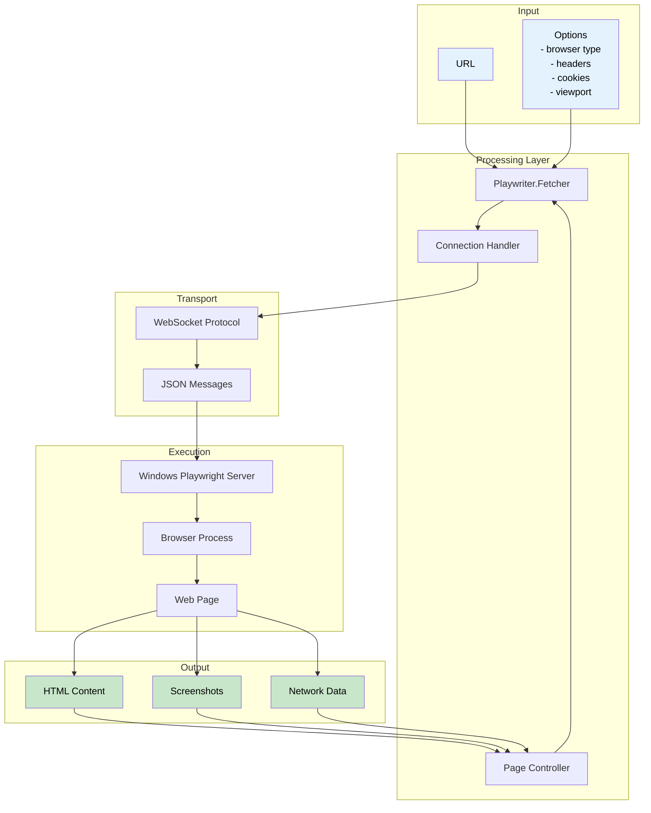
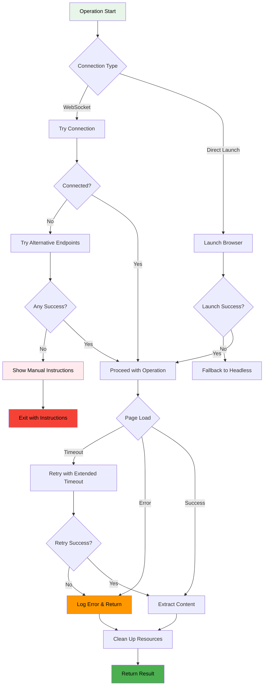
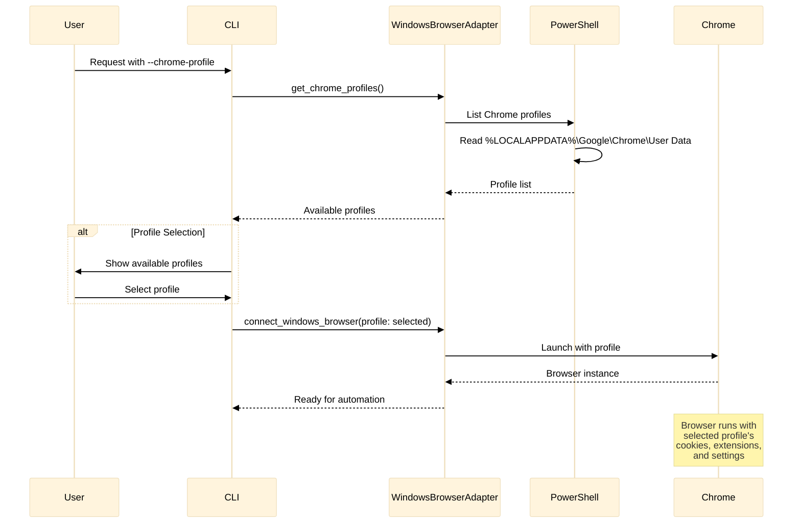
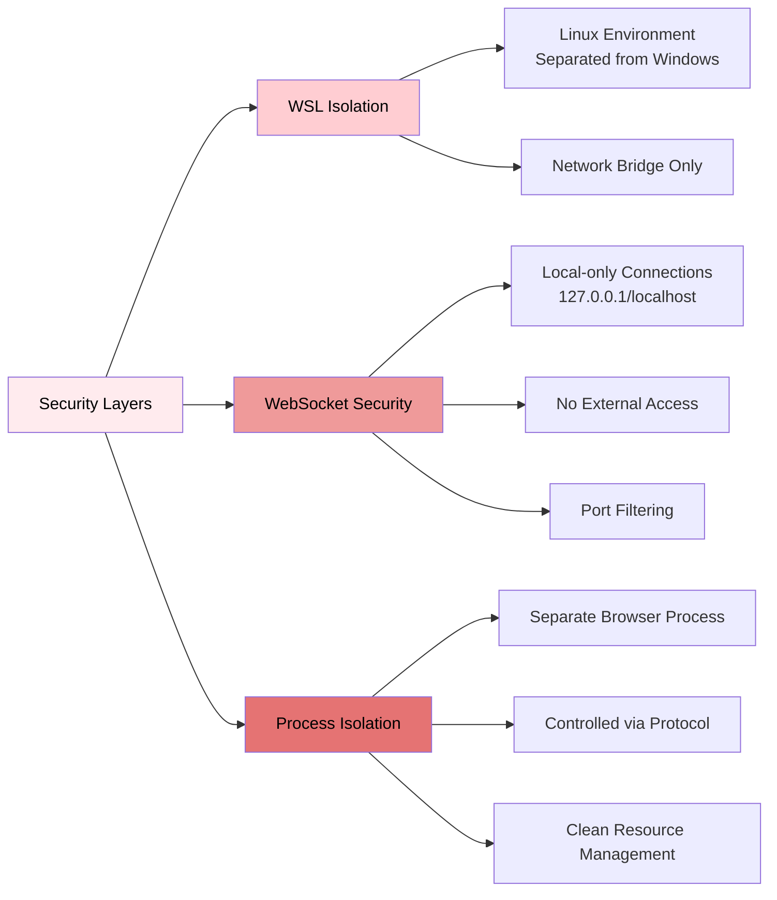
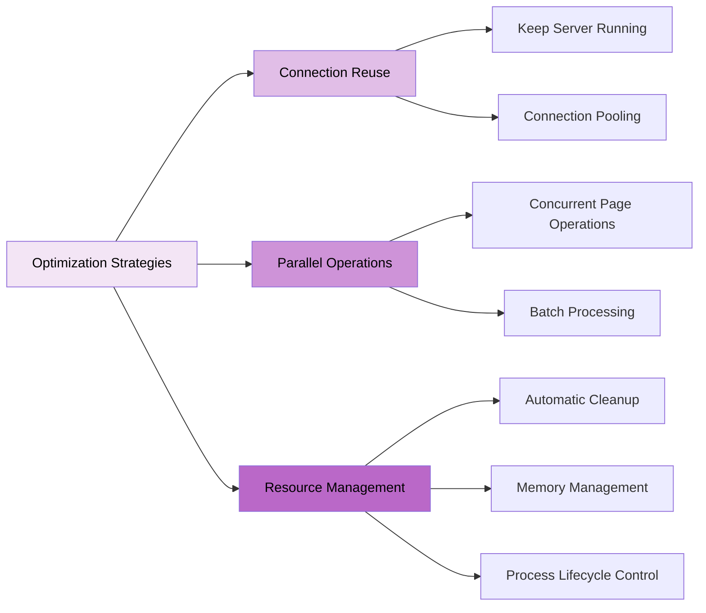

# Playwriter Architecture Diagrams

This document provides visual representations of Playwriter's architecture and workflows using Mermaid diagrams.

## Table of Contents
- [High-Level Architecture](#high-level-architecture)
- [WSL-to-Windows Bridge Flow](#wsl-to-windows-bridge-flow)
- [Component Interaction](#component-interaction)
- [WebSocket Connection Workflow](#websocket-connection-workflow)
- [Browser Launch Strategies](#browser-launch-strategies)
- [Data Flow Diagram](#data-flow-diagram)

## High-Level Architecture

## WSL-to-Windows Bridge Flow

## Component Interaction

## WebSocket Connection Workflow

## Browser Launch Strategies

## Data Flow Diagram

## Error Handling Flow

## Chrome Profile Integration

## Security Considerations

## Performance Optimization

---

These diagrams provide a comprehensive visual overview of Playwriter's architecture, making it easier to understand how the WSL-to-Windows browser automation works. The diagrams can be rendered in any Markdown viewer that supports Mermaid syntax, including GitHub, GitLab, and various documentation tools.